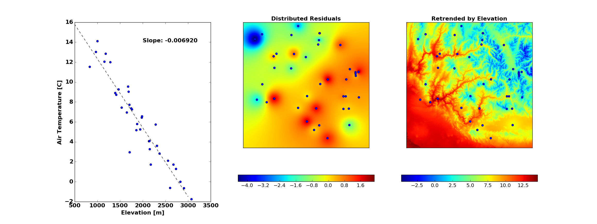

Distribution Methods
====================


Detrending Measurement Data
```````````````````````````

Most meterological variables used in SMRF have an underlying elevational gradient.  Therefore,
all of the distribution methods can estimate the gradient from the measurement data and apply
the elevational gradient to the DEM during distribution. Here, the theory of how the elevational
gradient is calcualted, removed from the data, and reapplied after distirbution is explained. All
the distribution methods follow this pattern and detrending can be ignored by setting ``detrend: False``
in the configuration.

**Calculating the Elevational Trend**

   The elevational trend for meterological stations is calculated using all available stations
   in the modeling domain. A line is fit to the measurement data with the slope as the elevational
   gradient (:numref:`Fig. %sa <air_temp_trend>` and :numref:`Fig. %sa <precip_trend>`). The slope
   can be constrained as positive, negative, or no contraint. 
   
   Gridded datasets have significantly more information than point measurements. Therefore, the
   approach is slightly different for calculating the elevational trend line.  To limit the number of
   grid cells that contribute to the elevational trend, only those grid cells within the mask are
   used.  This ensures that only the grid cells within the basin boundary contribute to the estimation
   of the elevational trend line.


**Distributing the Residuals**

   The point measurements minus the elevational trend at the stations (or grid cell's) elevation is 
   the measurement residual. The residuals are then distributed using the desired distribution
   method (:numref:`Fig. %sb <air_temp_trend>` and :numref:`Fig. %sb <precip_trend>`) and show the 
   deviance from the estimated elevational trend.

   
**Retrending the Distributed Residuals**

   The distributed residuals are added to the elevational trend line evaluated at each of the DEM 
   grid points.
   

Methods
```````

Inverse Distance Weighting
--------------------------

.. _air_temp_trend:



   Distribution of air temperature using inverse distance weighting. a) Air temperature as a function
   of elevation. b) Inverse distance weighting of the residuals. c) Retrending the residuals to the
   DEM elevation.


Detrended Kriging
-----------------

.. _precip_trend:

.. figure:: _static/precip_trend.png
   :scale: 75%
   :alt: Precipitation example.

   Distribution of precipitation using detrended kriging. a) Precipitation as a function
   of elevation. b) Kriging of the residuals. c) Retrending the residuals to the
   DEM elevation.
   
   

Gridded Interpolation
---------------------
