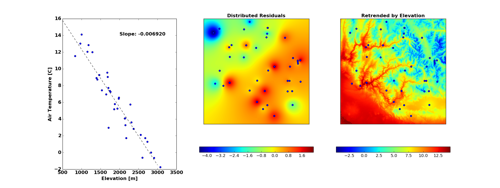
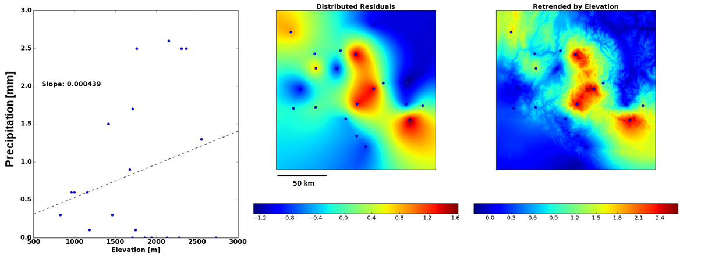
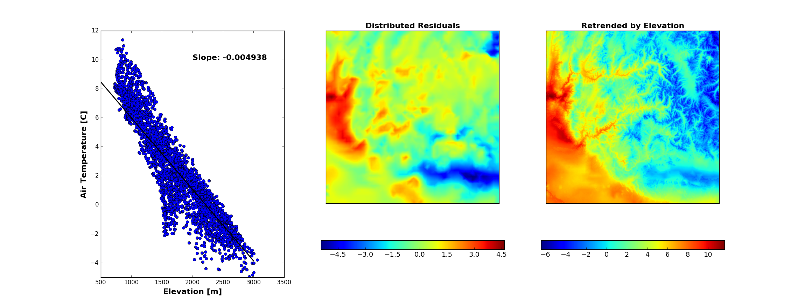

Distribution Methods
====================


Detrending Measurement Data
```````````````````````````

Most meterological variables used in SMRF have an underlying elevational gradient.  Therefore,
all of the distribution methods can estimate the gradient from the measurement data and apply
the elevational gradient to the DEM during distribution. Here, the theory of how the elevational
gradient is calculated, removed from the data, and reapplied after distribution is explained. All
the distribution methods follow this pattern and detrending can be ignored by setting ``detrend: False``
in the configuration.

**Calculating the Elevational Trend**

   The elevational trend for meterological stations is calculated using all available stations
   in the modeling domain. A line is fit to the measurement data with the slope as the elevational
   gradient (:numref:`Fig. %sa <air_temp_trend>`, :numref:`Fig. %sa <precip_trend>`, and :numref:`Fig. %sa <grid_trend>`). The slope
   can be constrained as positive, negative, or no constraint.

   Gridded datasets have significantly more information than point measurements. Therefore, the
   approach is slightly different for calculating the elevational trend line.  To limit the number of
   grid cells that contribute to the elevational trend, only those grid cells within the mask are
   used.  This ensures that only the grid cells within the basin boundary contribute to the estimation
   of the elevational trend line.


**Distributing the Residuals**

   The point measurements minus the elevational trend at the stations (or grid cell's) elevation is
   the measurement residual. The residuals are then distributed using the desired distribution
   method (:numref:`Fig. %sb <air_temp_trend>`, :numref:`Fig. %sb <precip_trend>`, and :numref:`Fig. %sb <grid_trend>`) and show the
   deviance from the estimated elevational trend.


**Retrending the Distributed Residuals**

   The distributed residuals are added to the elevational trend line evaluated at each of the DEM
   grid points (:numref:`Fig. %sc <air_temp_trend>`, :numref:`Fig. %sc <precip_trend>`, and :numref:`Fig. %sc <grid_trend>`). This
   produces a distributed value that has the underlying elevational trend in the measurement data but
   also takes into account local changes in that value.

.. note ::

   Constraints can be placed on the elevational trend to be either positive, negative, or no constraint.
   However, if a constraint is applied and the measurement data does not fit the constraint (for example
   negavite trend for air temp but there is a positive trend during an inversion or night time), then
   the slope of the trend line will be set to zero. This will distribute the data based on the underlying
   method and not apply any trends.


Methods
```````

The methods outlined below will distribute the measurement data or distribute the residuals if detrending
is applied.  Once the values are distributed, the values can be used as is or retrended.

Inverse Distance Weighting
--------------------------

.. _air_temp_trend:



   Distribution of air temperature using inverse distance weighting. a) Air temperature as a function
   of elevation. b) Inverse distance weighting of the residuals. c) Retrending the residuals to the
   DEM elevation.

Inverse distance weighting takes the weighted average of the measurment data based on the inverse of the
distance between the measurement location and the modeling grid :cite:`Shepard:1968`. For :math:`N`
set of measurement locations, the value at any :math:`x,y` location can be calculated:

.. math::

   u(x,y) = \frac{\sum\limits_{i=1}^{N} w_i(x,y)~u_i}{\sum\limits_{i=1}^{N}w(x,y)}

where

.. math::

   w_i(x,y) = \frac{1}{d_i(x,y)^p}

and :math:`d_i(x,y)` is the distance between the model grid cell and the measurement location raised to
a power of :math:`p` (typcially defaults to 2). The results of the inverse distance weighting, :math:`u(x,y)`,
is shown in :numref:`Figure %sb <air_temp_trend>`.


Detrended Kriging
-----------------

.. _precip_trend:



   Distribution of precipitation using detrended kriging. a) Precipitation as a function
   of elevation. b) Kriging of the residuals. c) Retrending the residuals to the
   DEM elevation.

Detrended kriging is based on the work developed by Garen et al. (1994) :cite:`Garen&al:1994`.

Detrended kriging uses a model semivariogram based on the station locations to distribute the measurement data
to the model domain. Before kriging can begin, a model semivariogram is developed from the measurement data
that provides structure for the distribution.  Given measurement data :math:`Z` for :math:`N` measurement
points, the semivariogram :math:`\hat{\gamma}` is defined as:

.. math::
   \hat{\gamma}( \mathbf{h} ) = \frac{1}{2m} \sum\limits_{i=1}^{m} [z(\mathbf{x}_i) - z(\mathbf{x}_i + \mathbf{h})]^2

where :math:`\mathbf{h}` is the seperation vector between measurement points, :math:`m` is the number of points at
lag :math:`\mathbf{h}`, and :math:`z(\mathbf{x})` and :math:`z(\mathbf{x} + \mathbf{h})` represent the
measurement values at locations seperated by :math:`\mathbf{h}`. For the purposes of the detrended kriging within
SMRF, :math:`m` will be one as all locations will have their unique lag distance :math:`\mathbf{h}`.

The kriging calculations require a semivariogram model to interpolate the measurement data.  Detrended kriging uses a
linear semivariogram :math:`\tau(\mathbf{h}) = \tau_n + bh` where :math:`\tau_n` is the nugget and :math:`b` is
the slope of the line.  A linear semivariogram model means that on average, :math:`Z` becomes increasing dissimilar at
larger lag distances. With the linear semivariogram model, ordinary kriging methods are used to calculate the weights
at each point through solving of a system of linear equations with the constraint of the weights summing to 1.  See
Garen et al. (1994) :cite:`Garen&al:1994` or :cite:`Geostats:2008` for a review of oridinary kriging methods.

In this implementation of detrended kriging, simplifications are made based on the use of the linear semivariogram.
With a linear semivariogram, the kriging weights are independent of the slope and nugget of the model, as the semivariogram
is a function of only the lag distance. Therefore, this assumption simplifies the kriging weight calculations as
:math:`\hat{\gamma}( \mathbf{h} ) = h`. There the weights only need to be calculated once when the current set of
measurement locations change. The kriging weights are futher constrained to only use stations that are within close
proximity to the estimation point.


Ordinary Kriging
----------------

Detrended kriging above is a specific application of ordinary kriging for distributing meterological data. A more generic
kriging approach is to use `PyKrige <https://pykrige.readthedocs.io/en/latest/>`_ that supports 2D ordinary and universal kriging.
See PyKrige documentation for more information and the :doc:`configuration file reference <core_config>` for specific
application within SMRF.


Gridded Interpolation
---------------------


.. _grid_trend:



   Distribution of air temperature using gridded interpolation. a) Air temperature as a function
   of elevation. b) Linear interpolation of the residuals. c) Retrending the residuals to the
   DEM elevation.

Gridded interpolation was developed for gridded datasets that have orders of magnitude more data than station measurements
(i.e. 3000 grid points for a gridded forecast). This ensures that the computions required for inverse distance weighting
or detrended kriging are not performed to save memory and computational time. The interpolation uses :mod:`scipy.interpolate.griddata`
(documentation `here`_) to interpolate the values to the model domain. Four different interpolation methods can be used:

* linear (default)
* nearest neighbor
* cubic 1-D
* cubic 2-D


.. _here: http://docs.scipy.org/doc/scipy/reference/generated/scipy.interpolate.griddata.html
