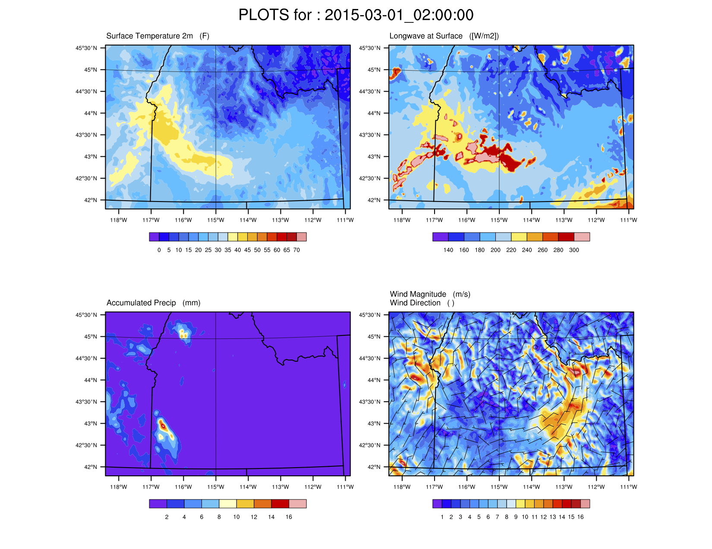

Input Data
==========

To generate all the input forcing data required to run iSnobal, the following
measured or derived variables are needed

* Air temperature
* Vapor pressure
* Precipitation
* Wind speed and direction
* Cloud factor

This page documents a more detailed description of each of the input variables,
the types of input data that can be used for SMRF, and the data format for
passing the data to SRMF.


Variable Descriptions
---------------------

Air temperature [Celcius]
   Measured or modeled air temperature at the surface

Vapor pressure [Pascals]
   Derived from the air temperature and measured relative humidity. Can be calculated
   using the IPW utility ``sat2vp`` or the SMRF function ``rh2vp``.

Precipitation [mm]
   Instantaneous precipitation with no negative values. If using a weighing precipitation
   gauge that outputs accumulated precipitation, the value must be converted.

Wind speed [meters per second]
   The measured wind speed at the surface. Typically an average value over the measurement
   interval.

Wind direction [degrees]
   The measured wind direction at the surface. Typically an average value over the measurement
   interval.

Cloud factor [None]
    The percentage between 0 and 1 of the incoming solar radiation that is obstructed by clouds.
    0 equates to no light and 1 equates to no clouds.  The cloud factor is derived from the
    measured solar radiation and the modeled clear sky solar raditation.  The modeled clear sky
    solar radiation can be calculated using the IPW utility ``twostream`` or the SMRF
    function ``model_solar``.


Input Data Types
----------------

All types of input data to SMRF are assumed to be point measurements.  Therefore, each measurement
location must have a X, Y, and elevation associated with it.

Weather Stations
````````````````

Generally, SMRF will be run using measured variables from weather stations in
and around the area of interest. Below are some potential websites for finding
data for weather stations:

* `Mesowest <http://mesowest.utah.edu>`_
* `NRCS SNOTEL <http://www.wcc.nrcs.usda.gov/snow/>`_
* `California Data Exchange Center <http://cdec.water.ca.gov/>`_

Gridded Model Output
````````````````````

Gridded datasets can be used as input data for SMRF. The typical use will be for downscaling gridded
weather model forecasts to the snow model domain in order to produce a short term snowpack forecast.
In theory, any resolution can be utilized, but the methods have been tested and developed using
Weather Reserach and Forecasting (`WRF <http://www.wrf-model.org/>`_) at a 1 and 3 km resolution. Each
grid point will be used as if it were a weather stations, with it's own X, Y, and elevation.  Therefore,
the coarse resolution model terrain can be taken into account when downscaling to a higher resolution DEM.



   Using WRF as a gridded dataset for SMRF.

See Havens et al. (2017) for more details and further discussion on using WRF for forcing iSnobal.

Data Formats
------------

CSV Files
`````````

Each variable requires its own CSV file plus a metadata file. See :mod:`smrf.data.csv_data` for more information.
The variable files must be structured as:

================  ====  ====  ====  ====
date_time         ID_1  ID_2  ...   ID_N
================  ====  ====  ====  ====
10/01/2008 00:00  5.2   13.2  ...   -1.3
10/01/2008 01:00  6.3   NAN   ...   -2.5
...               ...   ...   ...   ...
09/30/2009 00:00  10.3  21.9  ...   0.9
================  ====  ====  ====  ====

``date_time`` must be chronolgical and in any format that ``pandas.to_datetime()`` can parse.  Errors
will occur on import when pandas cannot parse the string.  The best format to use is MM-DD-YYYY HH:mm.

The column headers are the station ID numbers, which uniquely identify each station. The station ID
is used throughout SMRF to filter and specify stations, as well as the metadata.

The data for each station is in the column under the station ID.  Missing values can be included as
either ``NAN`` or blank, which will be converted to ``NaN`` in SMRF.  Missing data values will not
be included in the distribution calculations.

The metadata CSV file tells SMRF important information about the location for each stations.  At a minimum
the metadata file must have a primary_id, X, Y, and elevation. The locations must be in UTM and the elevation
is in same units as the DEM (typically meters).

==========  ======   =======  =========
primary_id  X        Y        elevation
==========  ======   =======  =========
ID_1        625406   4801625  1183
ID_2        586856   4827316  998
...         ...      ...      ...
ID_N        641751   4846381  2310
==========  ======   =======  =========

Example data files can be found in the ``tests`` directory for RME.


MySQL Database
``````````````

The MySQL database has been deprecated as of SMRF v0.11.0. If that feature is needed,
we recommend using v0.9.X or export the tables to csv format.


Weather Research and Forecasting (WRF)
``````````````````````````````````````

Gridded datasets can come in many forms and the :mod:`smrf.data.loadGrid` module is meant to import
gridded datasets.  Currently, SMRF can ingest WRF output in the standard wrf_out NetCDF files. SMRF
looks for specific variables with the WRF output file and converts them to the related SMRF values.
The grid cells are imported as if they are a single measurement station with it's own X, Y, and
elevation. The minimum variables required are:

Times
   The date time for each timestep

XLAT
   Latitude of each grid cell

XLONG
   Longitude of each grid cell

HGT
   Elevation of each grid cell

T2
   Air temperature at 2 meters above the surface

DWPT
   Dew point temperature at 2 meters above the surface, which will be used to calculate vapor pressure

GLW
   Incoming thermal radiation at the surface

RAINNC
   Accumulated precipitation

CLDFRA
   Cloud fraction for all atmospheric layers, the average will be used at the SMRF cloud factor

UGRD
   Wind vector, u component

VGRD
   Wind vector, v component


High Resolution Rapid Refresh (HRRR)
````````````````````````````````````

The `High Resolution Rapid Refersh (HRRR) <https://rapidrefresh.noaa.gov/hrrr/>`_ is a real time 3-km,
hourly atmospheric model with forecasts ran by NOAA. The data is focused on recent water years (>WY2017).
Loading the HRRR data into SMRF is performed by `weather_forecast_retrieval <https://github.com/USDA-ARS-NWRC/weather_forecast_retrieval>`_
based on a rigid directory structure used by the NOMADS archive. Because HHHR has a minimum of an 18 hour
forecast every hour, if a data file is not found or is incomplete, ``weather_forecast_retrieval`` will search
the previous forecasts for a good image for that specific time.

The variables used from HRRR are:

* Air temperature at 2 meters
* Relative humidity at 2 meters
* Wind u/v components at 10 meters
* Total precipitation for that hour
* Short wave radiation at the surface to calculated cloud factor
* Elevation of the terrain


Generic netCDF files
````````````````````

SMRF also has the ability to load generic netCDF files that may come from a variety of sources. At a minimum,
the netCDF file requires at a minimum the following fields:

* ``lat`` for the grid cell latitude
* ``lon`` for the grid cell longitude
* ``elev`` for the grid cell elevation
* ``time`` CF compliant time

Each variable name is specified in the configuration file and maps from the file variable to the SMRF variable.
