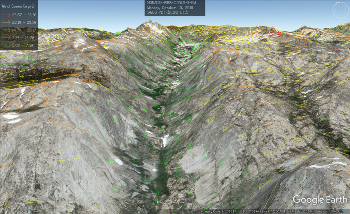
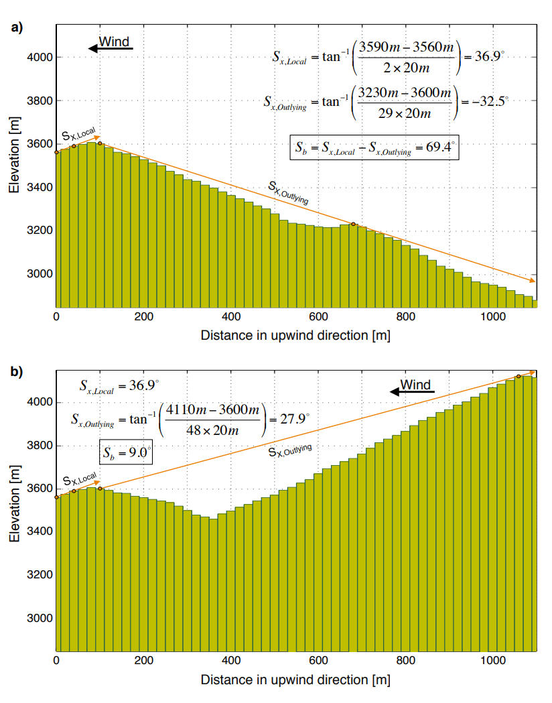

Wind Models
===========

Three wind distribution methods are available for the Wind class:

    1. Winstral and Marks 2002 method for maximum upwind slope (maxus)
    2. Import WindNinja simulations
    3. Standard interpolation

The type of wind model can be specfied in the ``[wind]`` section of the configuration file. The
options are ``winstral``, ``wind_ninja``, and ``interp``.

Wind Measurement Height
```````````````````````

This paragraph aims to be a cautionary note. Wind is an important driver for the turbulent fluxes
in a snow or hydrological model. However, atmospheric models and wind measurements can be taken at
a multitude of different heights. For example, with WindNinja, HRRR outputs at 10 meters above the ground
surface. WindNinja can then scale that to a different height (default is 5 meters in ``katana``). Therefore,
the wind speed that SMRF interpolates will be at 5 meters and that should match the measurement height
of wind in the snow or hydrology model.

The same is true with wind speed measurements as not all sensors are placed at the same height. Take care
to review the weather station metadata and convert the wind speed to fixed height above the ground before
using SMRF.

.. note::
    Check the wind measurement and output heights for consistency.


WindNinja
`````````

`WindNinja <https://github.com/firelab/windninja>`_ simulates wind over complex terrain using
a computational fluid dynamics approach and was originally developed for wildland fire forecasting.
WindNinja includes a conservation of mass and a conservation of mass and momentum solver, implemented
using OpenFOAM.



WindNinja has been built into a Docker image in `katana <https://github.com/USDA-ARS-NWRC/katana>`_ that
performs the WindNinja simulations. The function of Katana is to deal with the data editing and data flow
required to run WindNinja over large areas and long periods of time, as well as actually running WindNinja.
The power of Katana is that it organizes all of the necessary software (WindNinja, GDAL, wgrib2) into an
easy to use docker.

The steps that Katana takes are as follows:

1. Create topo ascii for use in WindNinja
2. Crop grib2 files to a small enough domain to actually run WindNinja as we cannot read in the full CONUS domain
3. Extract the necessary variables from the grib2 files
4. Organize the new, smaller grib2 files into daily folders
5. Create WindNinja config
6. Run WindNinja (one run per day)

.. note::
    
    ``katana`` must be ran prior to SMRF. 

SMRF reads the ASCII WindNinja outputs and interpolates (if needed) to the model domain. See the ``katana``
`README <https://github.com/USDA-ARS-NWRC/katana>`_ for more information on how to setup the configuration
file and what atmospheric models it can run. For SMRF, WindNinja is ran as if the vegetation was grass. 

Once WindNinja simulations have been performed, SMRF applies a log law scaling to adjust the simulated
wind field for the roughness of the vegetation height. The vegetation roughness in the log law scaling
is based on Brutsaert (1974) :cite:`Brutsaert:1974` and Cataldo and Zeballos (2009) :cite:`Cataldo&Zeballos:2009`.


Winstral Wind Model
```````````````````

The methods described here follow the work developed by Winstral and Marks (2002) and
Winstral et al. (2009) :cite:`Winstral&Marks:2002` :cite:`Winstral&al:2009` which parametrizes the terrain
based on the upwind direction. The underlying method calculates the maximum upwind slope (maxus) within a
search distance to determine if a cell is sheltered or exposed. See :mod:`smrf.utils.wind.model` for a more
in depth description. A maxus file (library) is used to load the upwind direction and maxus values over the
dem. The following steps are performed when estimating the wind speed:

1. Calculate the maxus values for the topo
2. Adjust measured wind speeds at the stations and determine the wind direction components
3. Distribute the flat wind speed and wind direction components
4. Simulate the wind speeds based on the distribute flat wind, wind direction, and maxus values

.. note::

    Winstral wind model works only with station measurements and not atmospheric models.

1. Maxus values
^^^^^^^^^^^^^^^

The azimuth **A** is the direction of the prevailing wind for which the maxus value will be calculated within
a maximum search distance **dmax**. The maxus (**Sx**) parameter can then be estimated as the maximum value of
the slope from the cell of interest to all of the grid cells along the search vector. The efficiency in selection
of the maximum value can be increased by using the techniques from the horizon function which calculates
the horizon for each pixel. Therefore, less calculations can be performed. Negative **Sx** values indicate an
exposed pixel location (shelter pixel was lower) and positive **Sx** values indicate a sheltered pixel (shelter
pixel was higher).

After all the upwind direction are calculated, the average **Sx** over a window is calculated. The average **Sx**
accounts for larger landscape obsticles that may be adjacent to the upwind direction and affect the flow.
A window size in degrees takes the average of all **Sx**.



2. Adjust measured wind speeds
^^^^^^^^^^^^^^^^^^^^^^^^^^^^^^

After the maxus is calculated for multiple wind directions over the entire DEM, the measured wind speed
and direction can be distributed. The first step is to adjust the measured wind speeds to estimate the wind speed if
the site were on a flat surface. The adjustment uses the maxus value at the station location and an
enhancement factor for the site based on the sheltering of that site to wind. A special consideration
is performed when the station is on a peak, as artificially high wind speeds can be calculated. If the station
is on a peak, the minimum maxus value is chosen for all wind directions. The wind direction
is then broken up into the u,v components.

3. Distribute flat wind speed and direction
^^^^^^^^^^^^^^^^^^^^^^^^^^^^^^^^^^^^^^^^^^^

Next the flat wind speed, u wind direction component, and v wind direction component are distributed using
the underlying SMRF distribution methods. 

4. Simulate wind speed with maxus
^^^^^^^^^^^^^^^^^^^^^^^^^^^^^^^^^

With the distributed flat wind speed and wind direction, the simulated wind
speeds can be estimated. The distributed wind direction is binned into the upwind directions in the maxus
library. This determines which maxus value to use for each pixel in the DEM. Each cell's maxus value is further
enhanced for vegetation, with larger, more dense vegetation increasing the maxus value (more sheltering) and
bare ground not enhancing the maxus value (exposed). With the adjusted maxus values, wind speed is estimated using
the relationships in Winstral and Marks (2002) and Winstral et al. (2009) :cite:`Winstral&Marks:2002`
:cite:`Winstral&al:2009` based on the distributed flat wind speed and each cell's maxus value.

Standard interpolation
``````````````````````

Standard interpolation using SMRF's :doc:`distribution methods <dist_methods>`.